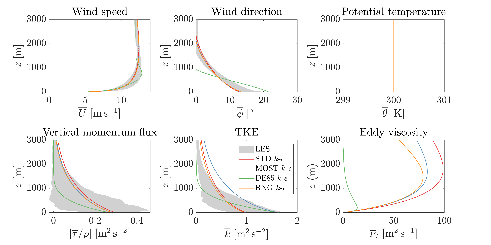
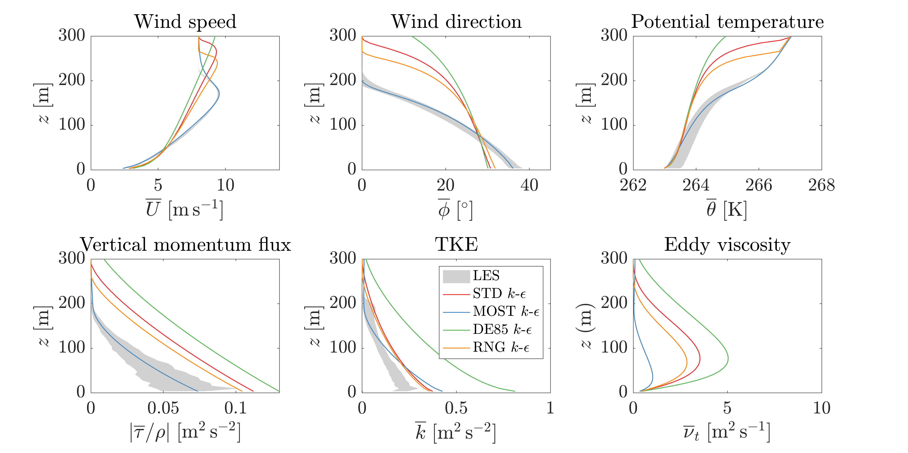

# SingleColumnModel

Single-column model (SCM) for testing turbulence parameterizations in atmospheric boundary layer (ABL) flows.

---

## Features

- **Numerics:** 4th order Runge–Kutta time integration; 2nd order finite difference in space  
- **RANS turbulence models:**
  - STD $k$ – $\epsilon$ (Launder & Spalding, 1974)
  - MOST $k$ – $\epsilon$ (van der Laan et al., 2017)
  - DE85 $k$ – $\epsilon$ (Detering & Etling, 1985)
  - RNG $k$ – $\epsilon$ (Yakhot & Orszag, 1986)
- **Wall treatment:** Shear-stress formulation via Monin–Obukhov Similarity Theory (MOST)
- **ABL cases:** Truly neutral boundary layer, stable boundary layer, and channel flow (In progress)

---

## Project layout

```matlab
SingleColumnModel/
├─ +BCs/                 % boundary conditions
├─ +Core/                % governing equations
├─ +Debug/               % debugging
├─ +Diagnostics/         % temporal averaging
├─ +FD/                  % finite difference
├─ +Init/                % initial profiles
├─ +IO/                  % saving, dumping
├─ +Namelists/           % case setups
├─ +Params/              % target parameters
├─ +Store/               % storing timeseries data
├─ +TimeInt/             % time integration
├─ +TurbMod/             % RANS turbulence models
├─ data/                 % saved data, etc.
   ├─ data/debug/        % failed scm run dumps
   ├─ data/les/          % sample les data
   └─ data/scm/          % saved scm runs
├─ plots/                % plotting
   └─ plots/figs/           % saved figures
├─ scripts/              % main running scripts
├─ tests/                % testing scripts
└─ utils/                % misc. helpers
```

---

## Quick start (MATLAB)

```matlab
% Run once per session: >> startup
startup

% === Set up a case ===
cfg.case        = "tnbl";                                                  % "sbl" | "tnbl" | "channelflow" | ...
cfg.t_end       = 90000;                                                   % [s] total simulated time
cfg.t_avg       = 600;                                                     % [s] averaging window
cfg.model       = "stdke";                                                 % turbulence model
cfg.params      = [0.09, 1.44, 1.92, 1.0, 1.0, 1.3];                       % model coefficients

% === Run a case ===
% Run single column model with specified cfg
[settings, params, avgVars, tsVars] = Core.scm_run(cfg.case, cfg.t_end, cfg.t_avg, cfg.model, cfg.params);
```
---

## Intercomparison with LES

Figures compare SCM mean profiles from different turbulence models against 10-minute averaged LES statistics.

- **Truly neutral boundary layer**

  <p align="center">
    
  </p>

- **Stable boundary layer**

  <p align="center">
    
  </p>

---

## Color scheme

Color palette from MathWorks File Exchange: Beautiful and distinguishable line colors + colormap
https://www.mathworks.com/matlabcentral/fileexchange/42673-beautiful-and-distinguishable-line-colors-colormap

--- 

## Contributing

Contributions are welcome—especially:
- New closures (local/non-local)
- Improved boundary conditions
- Alternative temporal/spatial schemes
- Additional validation cases and diagnostics.
  
Open an issue to discuss substantial changes.


